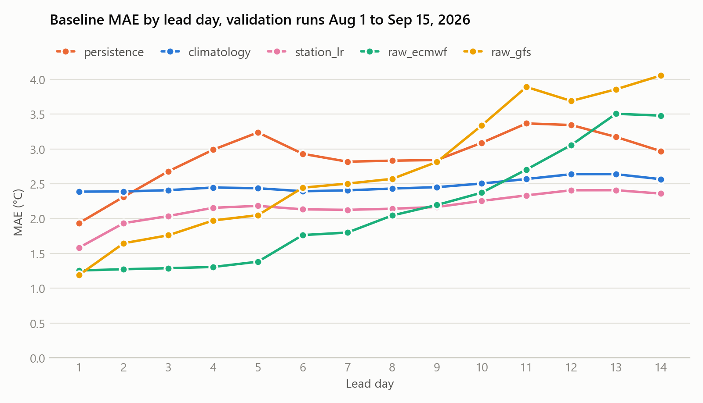
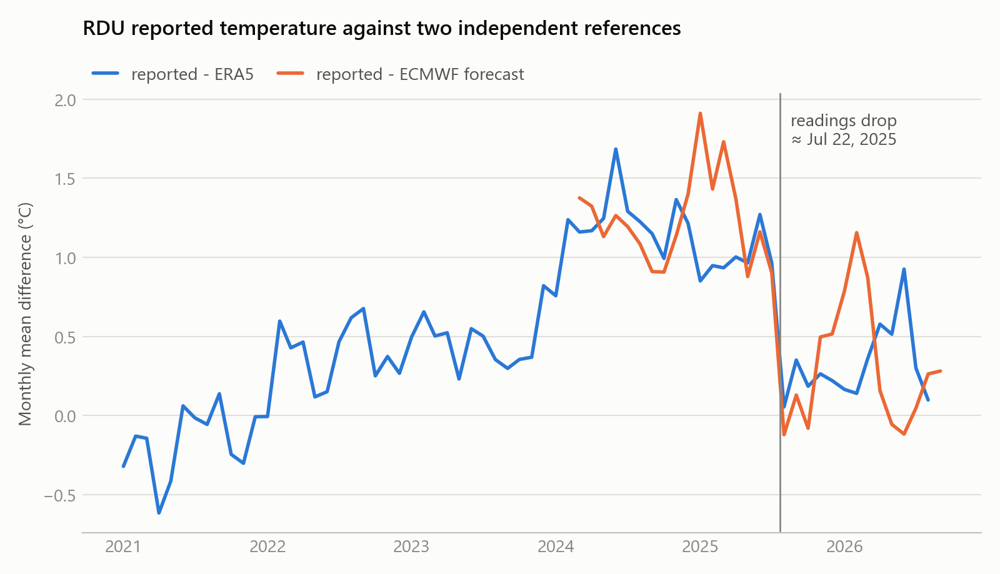

# Part 1: Data and evaluation framework

What was built for the first part of the team plan, item by item, with what
differs from the plan and what is still open. For the column dictionary and
code examples see [data_and_evaluation.md](data_and_evaluation.md).

## Where things stand

- All seven plan items are done. The code is in `src/weather_modeling/`, with
  runnable entry points in `scripts/` and 23 tests in `tests/` (all passing).
- This branch, `data-eval-framework`, is an independent implementation of the
  data pipeline and the evaluation. The team's models and final forecast are on
  the `shenwei` branch, which built the same pipeline separately; see
  [Cross-check](#cross-check-with-the-shenwei-branch).
- Three choices still need a team decision; see [Open decisions](#open-decisions).

## Cross-check with the `shenwei` branch

The two branches were written separately and use the same conventions: the same
hour labels, the same 12z runs, the same two purged folds. On the baselines both
compute, they agree to within 0.05 °C. MAE in °C with hours pooled, 2025 fold /
2026 fold:

| Baseline | `shenwei` branch | This branch |
|---|---|---|
| Raw ECMWF | 2.45 / 2.04 | 2.44 / 2.02 |
| Persistence | 3.83 / 2.88 | 3.87 / 2.86 |
| Climatology | 2.93 / 2.50 | 2.96 / 2.47 |

Only this branch has GFS, the record of when each run was published, the
station-break analysis and automated tests. Only the `shenwei` branch has the
models.

## The plan, item by item

### 1. Combined observation file

- `data/processed/obs_hourly.parquet`: every yearly file in `data/raw/ghcnh_rdu/`
  combined into 102,471 hourly reports, 2015-01-01 to 2026-09-16 23:51 EDT.
- Readings are stored as reported, each with its quality code, and the
  temperature with a quality class (see [Observation quality](#observation-quality)).
- The old `rdu_ghcnh_2015-01-01_to_2026-09-15.csv` held only the 8,755 rows of
  2015 and was removed.

### 2. ECMWF 12z runs

- Source: Open-Meteo Single Runs API, which returns each run as it was issued.
- 917 runs requested for 2024-03-14 to 2026-09-16; 912 stored, 910 used.
  Skipped: two that return "not available" (2025-08-08, 2026-06-10) and three
  that return only nulls (2025-08-04, -05, -06). Two more are excluded because
  nothing shows they were published in time (see
  [Rules on data use](#rules-on-data-use)).
- Variables: 2 m temperature, dew point, cloud cover, wind speed, precipitation,
  plus relative humidity, wind direction, shortwave radiation and sea-level
  pressure. Lead hours 0 to 360.
- GFS 12z runs were pulled the same way for the raw GFS baseline: 167 of 168
  runs from 2026-04-02, the first date in the archive (2026-09-14 is missing).
- Files: `data/raw/openmeteo_single_runs/<model>/<model>_12z_<year>.csv`.

### 3. Alignment

- All times are stored in UTC. `target_time_local` is the only local-time
  column and is derived last.
- A report at xx:51 is paired with the forecast for the next full hour, nine
  minutes later.
- **Hour labels: a report belongs to the clock hour it was taken in.** The
  report at 00:51 on Sep 17 is labelled Sep 17 00:00, so the first target is
  observed after the cutoff and every observation used as an input was taken
  before Sep 17 00:00 Eastern.
- The plan asked for this convention to be a single parameter until it was
  settled. It is settled, so the parameter was removed and this is the only
  convention the code implements.

Every historical 12z run is laid out like the real forecast: the cutoff is 16
hours after the run starts, and the 336 target hours follow as lead days 1-14.

### 4. Features

- **Climatology**: mean temperature by day of year and UTC hour, smoothed over
  ±10 days, from 2015-2023 (the plan says 2015-2025; see below).
- **Recent anomaly**: mean of observed minus climatology over the last 24 hours,
  7 days and 30 days, using reports up to 23:51 EDT on the run day.
- Also in the table: persistence, the last report before the cutoff, and each
  model's error over its first 16 hours.

The model-ready table is `data/processed/forecast_pairs.parquet`: 917 runs × 336
hours = 308,112 rows. GFS is missing in 82% of them because its archive starts
in 2026, so there are two training sets and no imputation: 286,693 rows with a
target and ECMWF (909 runs), and 53,148 rows with both models (165 runs).

### 5. Validation folds

| Fold | Validation runs | Trained on |
|---|---|---|
| `autumn_2025` | 2025-08-15 to 2025-10-15 | all earlier runs |
| `late_summer_2026` | 2026-08-01 to 2026-09-16 | all earlier runs |

Both are purged: a training row is kept only if its target time is earlier than
the first validation target.

### 6. Baselines

Mean absolute error in °C, with the 14 lead days weighted equally:

| Baseline | `autumn_2025` | `late_summer_2026` |
|---|---|---|
| Persistence | 3.88 | 2.89 |
| Climatology | 2.96 | 2.48 |
| Station-only LR (climatology + 24h anomaly) | 3.16 | 2.16 |
| Raw ECMWF | 2.45 | 2.10 |
| Raw GFS | no data | 2.70 |



These numbers are not comparable with scores reported in °F or pooled over
hours. Raw ECMWF on the 2026 fold is 2.10 °C here, 2.02 °C pooled over hours,
and 3.78 or 3.64 in °F. `reports/baselines_overall.csv` lists all four for every
baseline; `reports/baselines_validation.csv` has the per-lead-day numbers.

### 7. Shared code

| Module | Purpose |
|---|---|
| `config.py` | Paths, cutoff, forecast geometry, the settings listed below |
| `obs.py`, `nwp.py`, `climatology.py` | Loading each source; quality classes for observations |
| `dataset.py` | Builds and loads the model-ready table |
| `features.py` | Fourier terms for hour and day of year |
| `splits.py` | The folds and the purged split |
| `metrics.py` | MAE, RMSE, bias by lead day; bootstrap interval for a difference |
| `evaluation.py` | Baselines, cross-validation, lead-day figure, submission file, break sensitivity |
| `station_break.py` | The two alternative treatments of the July 2025 break |

## Beyond the plan

- **Leakage tests.** One test rebuilds runs from observations truncated at the
  cutoff and checks that no feature changes.
- **Final scoring.** `scripts/score_submission.py` scores forecast files against
  the observed Sep 17-30 temperatures. Those observations are kept apart in
  `data/raw/ghcnh_rdu_holdout/`.
- **Rules on data use**, **observation quality** and **the break in the station
  record**, described next.

## Rules on data use

The cutoff is Sep 17 2026 00:00 EDT (04:00 UTC).

| Rule | How it is met |
|---|---|
| Observations from before the cutoff may be used | The observation files end with the 23:51 EDT report of Sep 16 |
| Forecasts published before the cutoff may be used | Only runs up to Sep 16 12z are loaded; their publication time is recorded |
| Observations from after the cutoff only score frozen forecasts | Kept in a separate folder, read only by the scoring script, which logs a fingerprint of every forecast it scores |
| Reanalysis must not stand in for a forecast | ERA5 is used only to diagnose the station break, never as a feature or target |
| Missing truth is not filled in | The scoring script reports the hours scored and their quality classes |

A run's initialisation time is not its publication time, and the forecast
archive is keyed by the former. The pipeline assumes a run is available 16
hours after initialisation, which for the real forecast is the cutoff.
`scripts/check_run_availability.py` checks this against upload times on NOAA's
and ECMWF's public storage:

| | GFS | ECMWF |
|---|---|---|
| Runs used | 167 | 910 |
| Published after initialisation, median / latest | 5.1 h / 5.6 h | 7.9 h / 14.8 h |
| The Sep 16 12z run | 17:09 UTC, 10.8 h before the cutoff | 19:34 UTC, 8.4 h before the cutoff |

Two ECMWF runs (2024-09-17, 2025-02-24) were uploaded 37 and 24 hours after
initialisation and are excluded. For 119 ECMWF runs in 2024 the public files
stop at 240 hours, so the publication time of their last five forecast days is
not evidenced.

The truth for scoring is the :51 report of NOAA GHCNh station `USW00013722`.
The assignment does not prescribe a metric; see [Open decisions](#open-decisions).

## Observation quality

Each temperature keeps its GHCNh quality code and source, and gets one class.
What a code means depends on the source (GHCNh documentation, section VI).

| Class | Meaning | Reports | Treatment |
|---|---|---|---|
| `passed` | Passed NOAA's quality control | 98,256 | Used |
| `accepted` | Gross-limit check only, suspect but accepted, edited, or calculated | 39 | Used |
| `unverified` | No quality code | 4,168 | Used, after a plausibility check |
| `rejected` | Flagged suspect or erroneous | 8 | Set to missing |

Every report since 2026-03-27 is unverified. That is all validation targets of
the `late_summer_2026` fold and the whole target window.

## The break in the station record

RDU's reported temperature drops around 2025-07-22 relative to everything it
was compared with:

| Compared with | Drop |
|---|---|
| ECMWF forecasts, 12-35h ahead | 1.0 °C |
| ERA5 reanalysis | 0.7 °C |
| Greensboro, Rocky Mount, Fayetteville stations | 1.0, 0.8, 0.5 °C |



The drop appears in every weather type and within a single data source, so it
is neither the weather nor a change of data source. It shows that the two
periods were measured differently. It does not show which one is right, and the
cause is not confirmed.

**The primary analysis uses every reading as reported.** Two alternatives are
scored next to it as a sensitivity analysis, using only data available at each
fold's first cutoff: shifting the earlier readings by an estimated offset, and
dropping the earlier targets from training.

MAE in °C of a reference regression (ECMWF forecast, climatology, 24h anomaly):

| Treatment | `autumn_2025` | `late_summer_2026` |
|---|---|---|
| As reported (primary) | 2.69 | 1.82 |
| Shifted by an offset estimated at the time | 2.24 (1.49 °C, from 25 days) | 1.82 (0.96 °C, from 365 days) |
| Earlier targets dropped | too few runs | 1.83 |
| Raw ECMWF, for reference | 2.45 | 2.10 |

On the 2026 fold, which resembles the real forecast, the treatment makes no
difference. It matters only on the 2025 fold, which starts 25 days after the
break. The date of the break itself was identified with later data, so that
part is still hindsight. `scripts/break_sensitivity.py` reproduces the table;
the neighbour-station and weather-type checks were one-off and are not in the
scripts.

## Where this differs from the plan

- **Climatology years: 2015-2023, not 2015-2025.** With 2025 included, the
  validation targets of the `autumn_2025` fold would be part of their own
  climatology. The effect is small: the climatology baseline moves from 2.99 to
  2.91 on the 2025 fold and from 2.47 to 2.61 on the 2026 fold.
- **The combined observation file keeps five variables** (temperature, dew
  point, humidity, wind speed, pressure) instead of all 200 raw columns. More
  can be added in `OBS_COLUMNS` in `obs.py`; the raw files are untouched.

## Open decisions

| Decision | Where | Current |
|---|---|---|
| Climatology years | `CLIM_LAST_YEAR` in `config.py` | `2023` |
| Headline metric (not prescribed by the assignment) | arguments of `score_by` | MAE in °C, lead days weighted equally |
| Whether models train on all rows or only on rows after the break | filter on `target_before_break` | all rows |

Fix the headline metric before looking at test scores. After changing a
setting in `config.py`, re-run `scripts/build_dataset.py` and
`scripts/evaluate_baselines.py`.

Also still to do:

- **Re-download the test observations.** On Oct 4 NOAA had published 322 of the
  336 target hours (up to Sep 30 09:51 local).

## Reproducing it

```bash
python scripts/download_data.py            # observations up to the cutoff
python scripts/download_nwp.py             # ECMWF and GFS runs
python scripts/build_dataset.py            # processed tables
python scripts/evaluate_baselines.py       # baseline scores and figures
python scripts/break_sensitivity.py        # treatments of the station break
python scripts/check_station_break.py      # evidence for the break
python scripts/check_run_availability.py   # publication time of every run
pytest
python scripts/download_data.py --holdout  # test observations, final scoring only
```
