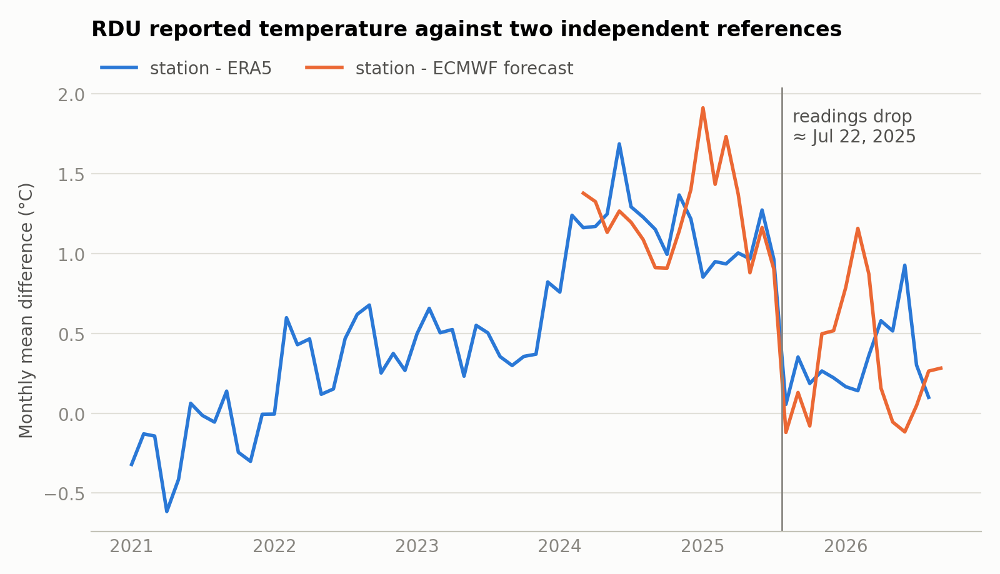

# Data checks

Two earlier checks on the inputs, and a cross-check of the baselines against a
second implementation. The checks are not part of the pipeline: their scripts
are kept in `scripts/deprecated/` and, like the others there, do not run from
that folder. The results below are the ones they produced.

| Script | Answers | Output in `scripts/deprecated/results/` |
|---|---|---|
| `scripts/deprecated/check_run_availability.py` | Was every forecast run published before it was used? | `run_availability.csv` |
| `scripts/deprecated/check_station_break.py` | Why does the ECMWF bias change in mid-2025? | `station_break_monthly.csv`, `station_break.png` |

The comparison of raw GFS with raw ECMWF, which used to be a third script here,
is now part of the notebooks: 03 adds the GFS forecast to the sample table, 04
compares the two on fold 2 and 05 on the test window.

| Period | Hours | Raw ECMWF MAE | Raw GFS MAE | Raw ECMWF RMSE | Raw GFS RMSE |
|---|---|---|---|---|---|
| Fold 2 (2026), from notebook 04 | 12,918 | 2.02 | 2.60 | 2.80 | 3.51 |
| Test, Sep 17-30, from notebook 05 | 322 | 3.27 | 4.03 | 4.07 | 5.19 |

The GFS archive starts on 2026-04-02 and lacks the 2026-09-14 run, so there are
167 runs and no GFS for fold 1.

## 1. When the runs were published

A run's initialisation time is not its publication time, and the Single Runs
archive is keyed by the former. The pipeline assumes a run is out by the
11pm-local origin of its forecast: about 16 hours after initialisation for the
12z run of the day, 28 hours for the 00z run. The script checks this against the
upload time of each run's last needed file on the public storage of NOAA (GFS)
and ECMWF (open data).

| | Runs | Published after initialisation (median) | In time |
|---|---|---|---|
| ECMWF 12z | 915 | 7.9 h | 913 |
| ECMWF 00z | 913 | 7.9 h | 913 |
| GFS 12z | 167 | 5.1 h | 167 |

- **The runs behind the real forecast**: the Sep 16 12z ECMWF run was uploaded
  at 19:34 UTC and the GFS run at 17:09 UTC, 8.4 and 10.8 hours before the
  cutoff (Sep 17 04:00 UTC).
- **Two ECMWF 12z runs are dated later than assumed**: 2024-09-17 (37 hours
  after initialisation) and 2025-02-24 (24 hours). This is not a breach of the
  assignment's rule: both were published well over a year before the real
  cutoff, so using them to train the final forecast is allowed. What it touches
  is the backtest, which treats each past run as if it were available 16 hours
  after initialisation. An upload time can only overstate the delay, so it does
  not even prove these two were late. They are 2 of 915 training runs and fall
  in neither validation fold; dropping them would make the backtest stricter and
  would not change the results in any visible way.
- **A gap in the evidence**: from 2024-07-16 to 2024-11-11 ECMWF's public files
  stop at 240 hours, so for those 119 runs the upload time is that of the
  240-hour file and says nothing about forecast days 11 to 15.

## 2. The July 2025 break in the station record

Against both ECMWF forecasts and the ERA5 reanalysis, the station's reported
temperature drops around 2025-07-22, after sitting higher since early 2024.

| Reference | Drop, 12 months after against 12 months before |
|---|---|
| ECMWF forecasts, 12-35 h ahead | 0.96 degC |
| ERA5 reanalysis | 0.72 degC |

This shows the readings before and after were measured differently. It does not
show which period is right, and the cause is not confirmed (NWS announced the
replacement of ASOS temperature sensors nationwide during 2025). ERA5 is used
only for this diagnosis, never as a feature or a target.

What it means for the models: a regression trained mostly on 2024 to mid-2025
learns that ECMWF is about 1 degC too cold, which no longer holds. That is
visible in `reports/figures/02_ecmwf_bias_by_month.png`, and it is why weighting
recent runs more helps, especially on fold 1, whose training targets almost all
predate the break.

The size of the step as it could have been estimated at the time, from ECMWF
alone: 1.49 degC at the start of fold 1 (from 25 days of data), 0.96 degC at the
start of fold 2 and at the real cutoff (from a full year).

## Cross-check with an independent implementation

The branch `data-eval-framework` builds the same pipeline separately, as a
package with tests. The two were written independently and agree on the
baselines both compute, to within 0.06 degC. MAE in degC, fold 1 / fold 2:

| Baseline | This repository (`reports/validation_summary.csv`) | `data-eval-framework` |
|---|---|---|
| Raw ECMWF | 2.44 / 2.02 | 2.44 / 2.02 |
| Persistence | 3.87 / 2.87 | 3.87 / 2.86 |
| Historical average / climatology | 2.90 / 2.49 | 2.96 / 2.47 |
| Raw GFS (fold 2 only) | 2.60 | 2.60 |

That branch also has two further checks of the station break that are not
reproduced here: against three stations about 100 km away the drop is 1.0, 0.8
and 0.5 degC, and it appears within every combination of day or night, cloud
cover and temperature band.
